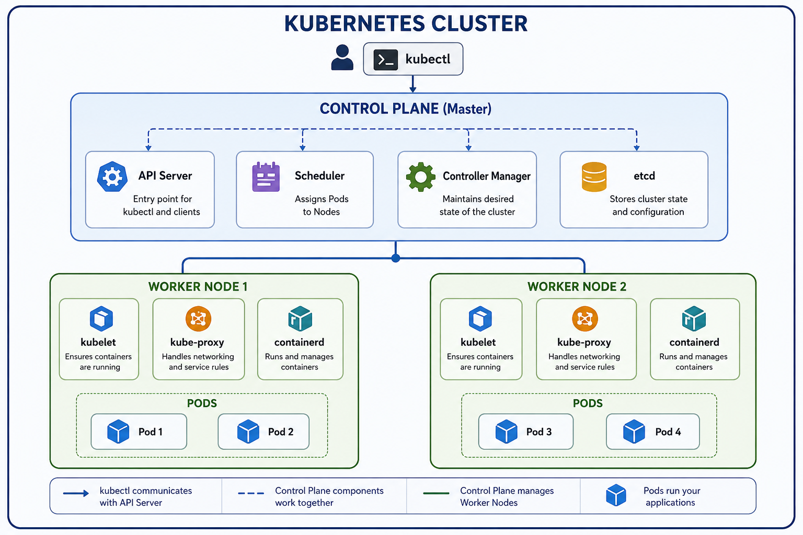
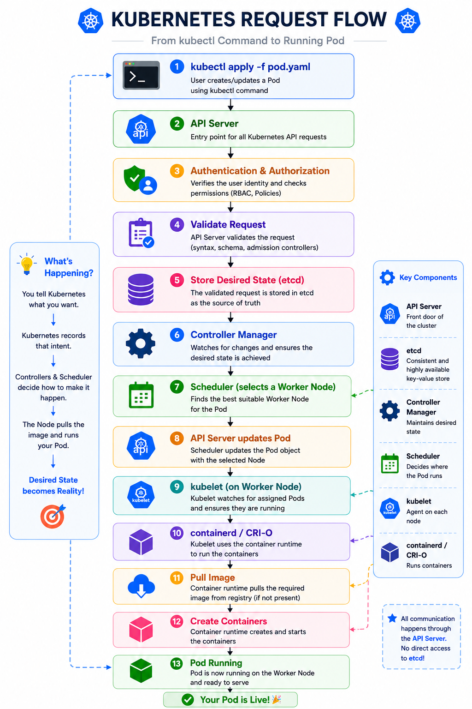
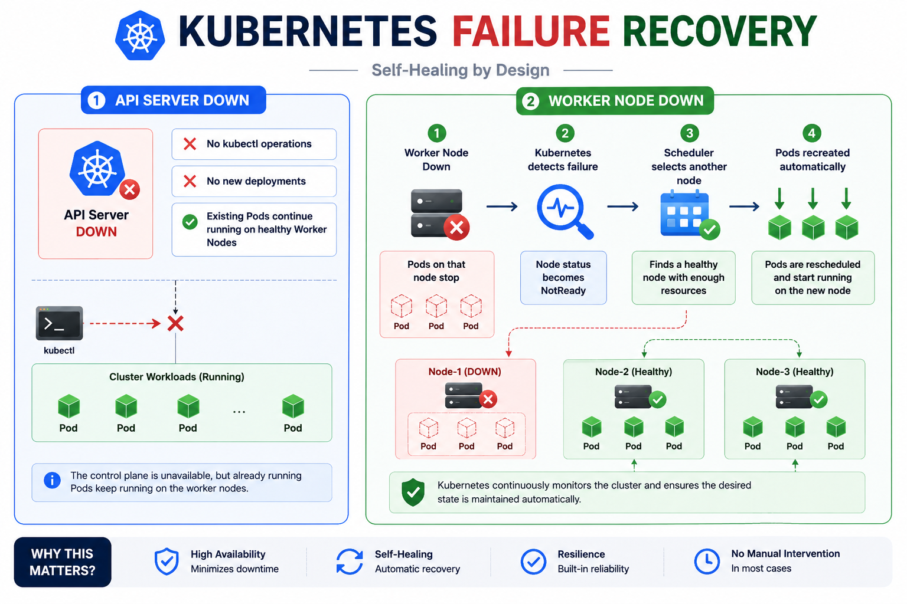

# Kubernetes Architecture

> Kubernetes is a container orchestration platform that automates deployment, scaling, networking, and self-healing of containerized applications.

---

# 1. Why Kubernetes Exists

Docker allows you to build and run containers, but it focuses on running containers on a **single machine**. As applications grow across multiple servers, managing containers manually becomes difficult.

Kubernetes solves this by automatically:

- Scaling applications
- Scheduling containers across nodes
- Recovering from failures
- Managing networking and service discovery
- Maintaining the desired state of applications

> 💡 **Docker runs containers. Kubernetes manages containers at scale.**

---

# 2. History

| Topic | Details |
|-------|---------|
| **Created By** | Google |
| **Open-Sourced** | 2014 |
| **Maintained By** | CNCF (Cloud Native Computing Foundation) |
| **Inspired By** | Google's Borg system |
| **Abbreviation** | K8s (8 letters between K and S) |

---

# 3. Kubernetes Architecture

A Kubernetes cluster consists of two major parts:

- **Control Plane** – Makes decisions and manages the cluster.
- **Worker Nodes** – Run the application workloads.



---

## 3.1 Control Plane Components

The **Control Plane** manages the entire Kubernetes cluster. It makes scheduling decisions, maintains the desired state, and coordinates all cluster operations.

| **Component** | **Responsibility** |
|--------------|--------------------|
| **API Server** | Acts as the central entry point for all Kubernetes API requests and communication between cluster components. |
| **Scheduler** | Selects the most suitable Worker Node for newly created Pods based on available resources and scheduling policies. |
| **Controller Manager** | Continuously monitors the cluster and ensures the actual state matches the desired state. |
| **etcd** | A distributed key-value database that stores the cluster's configuration, metadata, and current state. |

---

## 3.2 Worker Node Components

A **Worker Node** is responsible for running application workloads. It hosts Pods and contains the components required to execute and manage containers.

| **Component** | **Responsibility** |
|--------------|--------------------|
| **kubelet** | A node agent that communicates with the API Server and ensures Pods are running as expected. |
| **kube-proxy** | Manages network rules and enables communication between Pods and Services. |
| **Container Runtime** | Pulls container images and runs containers on the node (e.g., **containerd**, **CRI-O**). |

---

# 4. Kubernetes Request Flow

Whenever you execute:

```bash
kubectl apply -f pod.yaml
```

The request flows through the following stages:



| Step | Process |
|------|---------|
| **1** | `kubectl` sends the request to the API Server |
| **2** | API Server authenticates and authorizes the request |
| **3** | API Server validates the manifest |
| **4** | Desired state is stored in **etcd** |
| **5** | Controller Manager detects the new Pod |
| **6** | Scheduler selects the most suitable Worker Node |
| **7** | API Server updates the Pod assignment |
| **8** | kubelet receives the instruction |
| **9** | Container Runtime pulls the image (if required) |
| **10** | Container starts and the Pod becomes **Running** |

> 💡 **All communication inside Kubernetes goes through the API Server.**

---

# 5. Failure Recovery

Kubernetes is designed with **self-healing** capabilities.



## 5.1 API Server Failure

If the **API Server** becomes unavailable:

- ❌ `kubectl` commands cannot be executed.
- ❌ No new deployments can be created.
- ✅ Existing Pods continue running on Worker Nodes.

---

## 5.2 Worker Node Failure

If a **Worker Node** fails:

1. Kubernetes detects the failed node.
2. The node status changes to **NotReady**.
3. Scheduler selects another healthy node.
4. Pods are recreated automatically.
5. Applications continue running with minimal downtime.

> 💡 Kubernetes continuously works to match the **desired state** with the **actual state**.

---

# 6. kubeconfig

`kubeconfig` is the configuration file used by **kubectl** to connect to Kubernetes clusters.

It stores:

- Cluster information
- User credentials
- Contexts
- Certificates

**Default Location**

```bash
~/.kube/config
```

Useful commands:

```bash
kubectl config current-context
kubectl config get-contexts
kubectl config view
```

---

# 7. Built-in Namespaces

| Namespace | Purpose |
|-----------|---------|
| `default` | Default namespace for user resources |
| `kube-system` | Kubernetes system components |
| `kube-public` | Public resources |
| `kube-node-lease` | Stores node heartbeat information |

---

# 8. Common kubectl Commands

```bash
# Display cluster information
kubectl cluster-info

# List Worker Nodes
kubectl get nodes

# List all Pods
kubectl get pods -A

# List Pods in kube-system
kubectl get pods -n kube-system

# Show current context
kubectl config current-context

# List available contexts
kubectl config get-contexts

# View kubeconfig
kubectl config view
```

---

# 9. Key Takeaways

- ✅ Kubernetes follows a **Control Plane + Worker Node** architecture.
- ✅ The **API Server** is the central communication hub.
- ✅ **etcd** stores the cluster's desired state.
- ✅ The **Scheduler** decides where Pods run.
- ✅ **kubelet** ensures containers stay healthy.
- ✅ Kubernetes automatically detects failures and recreates Pods when required.
- ✅ Kubernetes continuously maintains the **desired state** of the cluster.
