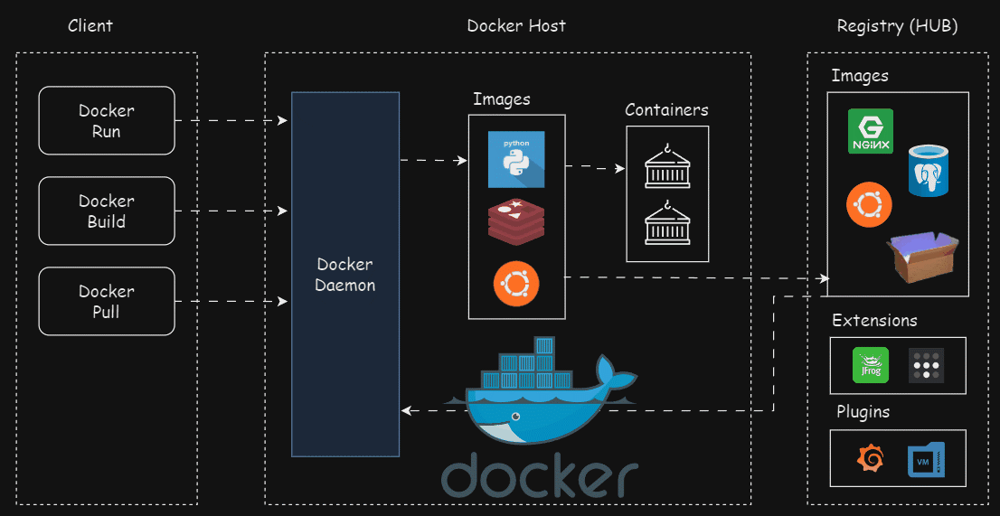

# Docker Fundamentals

## What is Docker?

Docker is an open-source containerization platform that packages an application, its dependencies, libraries, and configuration into a lightweight container that runs consistently across different environments.

---

## Why Docker?

- Build applications locally and deploy them consistently across any environment.
- Eliminates the **"Works on My Machine"** problem.
- Shares the host operating system kernel, making it more resource-efficient than virtual machines.
- Provides faster application startup and deployment.
- Simplifies collaboration by ensuring the same environment for every developer.
- Supports modern microservices and cloud-native applications.

---

## Containers vs Virtual Machines

| Feature | Virtual Machines (VMs) | Containers |
|---------|-------------------------|------------|
| Virtualization Level | Hardware-level virtualization | OS-level virtualization |
| Architecture | Includes guest OS and hypervisor | Shares the host OS kernel |
| Size | Large (GBs) | Lightweight (MBs) |
| Startup Time | Minutes | Seconds |
| Performance | Higher overhead | Near-native performance |
| Isolation | Strong (Separate OS per VM) | Process-level isolation |
| Resource Usage | High CPU, RAM, and Storage | Efficient resource usage |
| Portability | Less portable | Highly portable |
| Management | Full operating system management | Application and dependency management |
| Best For | Legacy applications and multiple operating systems | Microservices, CI/CD, and cloud-native applications |

---

## Docker Architecture

Docker Architecture consists of four main components:

- Docker Client
- Docker Daemon
- Docker Host
- Docker Registry (Docker Hub)
  

The Docker Client sends requests to the Docker Daemon, which builds images, creates containers, manages Docker resources, and interacts with Docker registries such as Docker Hub.

---

## Docker Client

### What it is

The Docker Client is the interface used to communicate with Docker. It accepts user requests and sends them to the Docker Daemon for execution.

### How it works

- Accepts commands from the user.
- Sends requests to the Docker Daemon.
- Displays the results.

---

## Docker Daemon

### What it is

The Docker Daemon (`dockerd`) is the background service responsible for managing Docker resources on the host machine.

### How it works

The Docker Daemon:

- Builds Docker images.
- Creates and manages containers.
- Handles networking.
- Manages storage volumes.
- Communicates with Docker registries.

---

## Docker Hub

### What it is

Docker Hub is Docker's official **public cloud registry** used to store, share, and distribute container images.

### How it works

Docker Hub allows users to:

- Pull official and community images.
- Push custom images.
- Share versioned images.
- Store public repositories.

### Usage

Docker Hub is commonly used to download existing images or publish custom application images.

---

## Docker Registry

### What it is

Docker Hub is the most popular public Docker Registry. A Docker Registry is the general term for any service that stores Docker images, whether public or private.

### How it works

A Docker Registry:

- Stores Docker images.
- Allows users to pull images.
- Allows users to push images.
- Enables secure image sharing within organizations.

Private registries are commonly used by companies to store internal application images securely.

---

## Install Docker

Official Documentation:

- [Install Docker](https://docs.docker.com/engine/install/)
