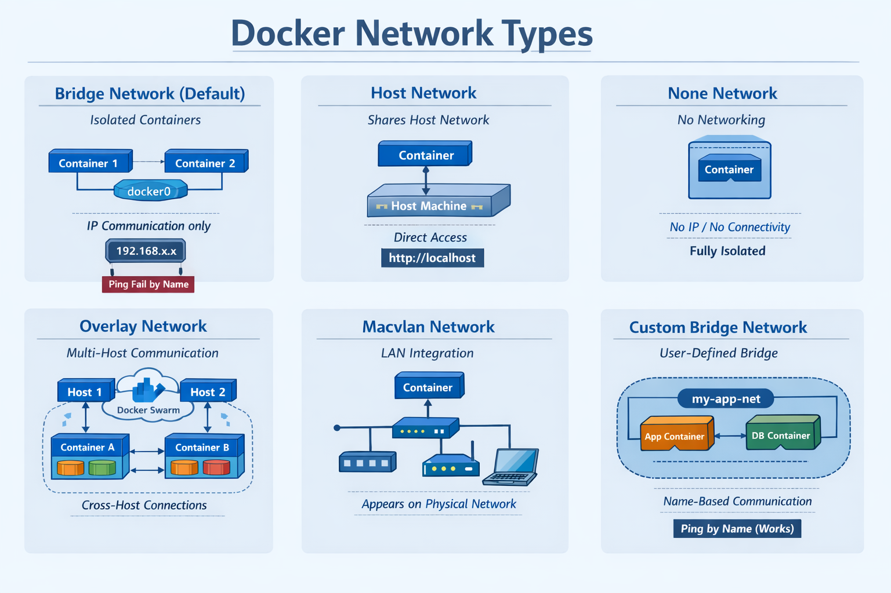

# Docker Networking

## What is Docker Networking?

Docker Networking enables containers to communicate:

- With each other
- With the host machine
- Across multiple Docker hosts

By default, containers run in isolation. Docker Networks provide controlled communication between containers and external systems.

---

## Why Docker Networking?

- Enables communication between containers.
- Isolates applications for better security.
- Supports multi-container applications.
- Simplifies service discovery using DNS.
- Provides different network drivers for different use cases.

---

## Docker Networking Architecture

Docker follows a network model where containers communicate through network drivers such as Bridge, Host, Overlay, and Custom Bridge.



---

## List Docker Networks

```bash
docker network ls
```

---

## Inspect a Docker Network

```bash
docker network inspect bridge
```

---

# Docker Network Types

Docker provides multiple network drivers to support different networking requirements.

---

## Bridge Network

The **Bridge Network** is Docker's default network driver.

It:

- Is used for standalone containers.
- Creates a virtual bridge (`docker0`).
- Assigns private IP addresses.
- Allows communication using IP addresses.
- Does **not** provide automatic DNS name resolution.

### Example

Create two containers.

```bash
docker run -dit --name c1 alpine sh

docker run -dit --name c2 alpine sh
```

Ping using the container name.

```bash
docker exec -it c2 ping c1
```

Result:

```text
Fails
```

Inspect the first container.

```bash
docker inspect c1
```

Ping using the container IP.

```bash
docker exec -it c2 ping <container-ip>
```

Result:

```text
Works
```

---

## Host Network

The container shares the host machine's network stack.

It:

- Removes network isolation.
- Uses the host IP address.
- Does not require port mapping.
- Is suitable for high-performance networking.

### Example

```bash
docker run --network host nginx
```

Access the application:

```text
http://localhost
```

---

## None Network

The **None Network** completely disables networking.

It:

- Does not assign an IP address.
- Prevents external communication.
- Is suitable for secure or isolated workloads.

---

## Overlay Network

Overlay networks enable communication between containers running on different Docker hosts.

They:

- Support multi-host communication.
- Are commonly used with Docker Swarm.
- Provide built-in DNS-based service discovery.

---

## Macvlan Network

Macvlan assigns a unique MAC address to each container.

It:

- Makes containers appear as physical devices on the network.
- Allows direct communication with the local network.
- Is commonly used for legacy applications.

---

## Custom Bridge Network

A Custom Bridge Network is a user-defined bridge network.

Unlike the default Bridge Network, it provides automatic DNS resolution between containers.

It:

- Allows communication using container names.
- Provides better isolation.
- Is recommended for multi-container applications.

### Example

Create a custom network.

```bash
docker network create my-app-net
```

Run two containers.

```bash
docker run -dit --name app --network my-app-net alpine sh

docker run -dit --name db --network my-app-net alpine sh
```

Test communication.

```bash
docker exec -it app ping db
```

Result:

```text
Works
```

Both containers communicate successfully because they belong to the same user-defined network.

---

# Network Types Comparison

| Network Type | Scope | Name Resolution | Common Use Case |
|--------------|-------|-----------------|-----------------|
| Bridge | Single Host | No | Standalone Containers |
| Host | Single Host | N/A | High-Performance Applications |
| None | Single Host | No | Secure or Isolated Workloads |
| Overlay | Multiple Hosts | Yes | Docker Swarm & Microservices |
| Macvlan | Local Network | No | Legacy Applications |
| Custom Bridge | Single Host | Yes | Multi-Container Applications |

---

# When to Use Which Network?

## Bridge Network

- Standalone containers
- Local testing
- Basic container communication

---

## Custom Bridge Network

- Application and database communication
- Docker Compose projects
- Multi-container applications

---

## Host Network

- High-performance applications
- Network-intensive workloads

---

## None Network

- Secure containers
- Offline or isolated workloads

---

## Overlay Network

- Docker Swarm
- Multi-host deployments
- Microservices architecture

---

## Macvlan Network

- Legacy applications
- Containers requiring direct LAN access

---

# Key Takeaways

- Docker Networking enables communication between containers and external systems.
- Bridge is the default network for standalone containers.
- Custom Bridge provides automatic DNS-based communication.
- Host Network shares the host's network stack.
- None Network completely disables networking.
- Overlay Network enables communication across multiple Docker hosts.
- Macvlan makes containers appear as physical devices on the network.
